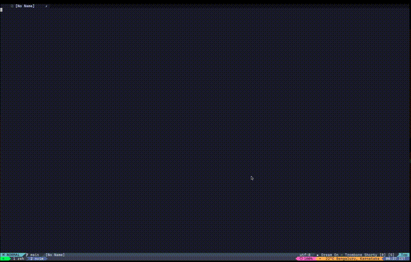

# 🎷 spotify.nvim
A Simple plugin to control Spotify from within NeoVim on MacOS 



## ✨ Description

The plugin basically uses applescript to control basic functionality like **Volume change, Playpause,
Next/Previous tracks, Toggling Shuffle/Repeat/Mute**, and provides additional support for displaying
now-playing status in any **statusline** plugin of your choice. I would additionally recommend a notification plugin
like [noice.nvim](https://github.com/folke/noice.nvim) to get beautiful status updates as **toasts**. Most importantly,
it supports a **count** before some of the commands, allowing better control than the F7-F12 hardware keys. For instance,
`5<leader>+` to increase volume by 50 points or `5<leader>pn` to play next track 5 times, thereby skipping tracks in between.

Spotify.nvim is a learning project to understand vim and lua. Instead of constantly alt-tabbing, relying on the rudimentary F7-F12 keys
or opening a terminal to run my bash scripts, I can now use this plugin to do it all within Neovim. While there are
better alternatives like [music-controls.nvim](https://github.com/AntonVanAssche/music-controls.nvim) they all use external
libraries like `playerctl` or require additional python/go installations and Spotify API keys.

I hope that others who have similar needs for a simple no additional installation plugin will find *spotify.nvim* useful as well.

## ⚡️ Requirements

MacOS, NeoVim, Spotify

## 📦 Installation

> [!important]
> The keymaps you pass for overriding the defaults have to match the name property to be set-up correctly.
> The below example shows how to properly override existing keymaps. Default keymaps are shown in [Configuration](#configuration)
> Check the [code](https://github.com/spinalshock/spotify.nvim/blob/main/lua/spotify/init.lua) to see how the setup function handles overrides.

This example uses [lazy.nvim](https://github.com/folke/lazy.nvim) to install/load
the plugin. Other plugin managers can be used as well.

```lua
  -- lazy
  {
    'spinalshock/spotify.nvim',
    dependencies = {
          { 'folke/noice.nvim' }, -- optional
          { 'folke/which-key.nvim' }, -- optional
          { 'nvim-lualine/lualine.nvim' }, -- optional
      },
    opts = { -- Default configuration options (optional for user overrides)
      keymaps = {
        -- Example: Default keymaps can be replaced by user-defined keymaps here.
        -- { name = 'play_pause', mode = 'n', '<leader>0', ':SpotifyPlayPause<cr>', desc = 'Play/Pause Spotify' },
        -- { name = 'next', mode = 'n', '<leader>9', ':<C-U>SpotifyNext<CR>', desc = 'Next Spotify Track' },
        -- add more custom keymaps as needed.
      },
    },
    config = function(_, opts)
      require('spotify').setup(opts) -- pass user options to the plugin setup
    end,
  },
```

## ⚙️  Configuration

Spotify.nvim comes with the following defaults:

```lua
{
  -- Default key mappings
   local default_keymaps = {
  { name = 'play_pause',     mode = 'n', '<leader>pp', ':SpotifyPlayPause<CR>',     desc = 'Play/Pause Spotify' },
  { name = 'next',           mode = 'n', '<leader>pn', ':<C-U>SpotifyNext<CR>',     desc = 'Next Spotify Track' },
  { name = 'previous',       mode = 'n', '<leader>pb', ':<C-U>SpotifyPrev<CR>',     desc = 'Previous Spotify Track' },
  { name = 'volume_up',      mode = 'n', '<leader>+',  ':<C-U>SpotifyVolUp<CR>',    desc = 'Increase Spotify Volume' },
  { name = 'volume_down',    mode = 'n', '<leader>-',  ':<C-U>SpotifyVolDown<CR>',  desc = 'Decrease Spotify Volume' },
  { name = 'shuffle_toggle', mode = 'n', '<leader>ps', ':SpotifyToggleShuffle<CR>', desc = 'Toggle Spotify Shuffle' },
  { name = 'repeat_toggle',  mode = 'n', '<leader>pr', ':SpotifyToggleRepeat<CR>',  desc = 'Toggle Spotify Repeat' },
  { name = 'sound_volume',   mode = 'n', '<leader>pv', ':SpotifyVolume<CR>',        desc = 'Show Spotify Volume' },
  { name = 'info',           mode = 'n', '<leader>pi', ':SpotifyInfo<CR>',          desc = 'Show Spotify Info' },
  { name = 'mute_toggle',    mode = 'n', '<leader>pm', ':SpotifyToggleMute<CR>',    desc = 'Toggle Spotify Mute' }, 
}
```

## Statusline integration

> [!tip]
> Check the statusline command [here](https://github.com/spinalshock/spotify.nvim/blob/main/lua/spotify/commands.lua).
> Use the lualine config shown below to get a similar setup to the shown video.

Spotify.nvim provides integration with statusline plugins such as
[lualine](https://github.com/nvim-lualine/lualine.nvim) and [galaxyline](https://github.com/nvimdev/galaxyline.nvim),
allowing you to display the current music player status directly within your statusline.

### example (lualine)

this example demonstrates how to integrate current song status with lualine.
other statusline plugins can be used as well, and the process should be similar.
refer to the documentation of your statusline plugin for more information.

```lua
local spotify_status = require('spotify.commands').statusline
require('lualine').setup {
  sections = {
    lualine_y = { spotify_status }
  }
}
```

## 🌈 Usage

> [!tip]
> Count support refers to **vim.v.count1**
> You can introduce count before the <leader> key to repeat <count> times.
> Eg: `4<leader>-` reduces volume by 40%

<details>
<summary>Click to see different ways to use the plugin</summary>

<!-- hl_start -->

| **Keymap**        | **Command**                | **Description**                | **Count Support** |
|-------------------|----------------------------|--------------------------------|-------------------|
| `<leader>pp`      | `:SpotifyPlayPause<CR>`    | Play/Pause Spotify             | No                |
| `<leader>pn`      | `:SpotifyNext<CR>`         | Next Spotify Track             | Yes               |
| `<leader>pb`      | `:SpotifyPrev<CR>`         | Previous Spotify Track         | Yes               |
| `<leader>+`       | `:SpotifyVolUp<CR>`        | Increase Spotify Volume        | Yes               |
| `<leader>-`       | `:SpotifyVolDown<CR>`      | Decrease Spotify Volume        | Yes               |
| `<leader>ps`      | `:SpotifyToggleShuffle<CR>`| Toggle Spotify Shuffle         | No                |
| `<leader>pr`      | `:SpotifyToggleRepeat<CR>` | Toggle Spotify Repeat          | No                |
| `<leader>pv`      | `:SpotifyVolume<CR>`       | Show Spotify Volume            | No                |
| `<leader>pi`      | `:SpotifyInfo<CR>`         | Show Spotify Info              | No                |
| `<leader>pm`      | `:SpotifyMuteToggle<CR>`   | Mute/Unmute Spotify            | No                |


<!-- hl_end -->

## 🪪 License

spotify.nvim is licensed under the mit license. see the [license.md](./license.md)
file for more information.

## 📝 Contributing

contributions are welcome! please feel free to submit a pull request or open an issue
for any bugs or feature requests.
